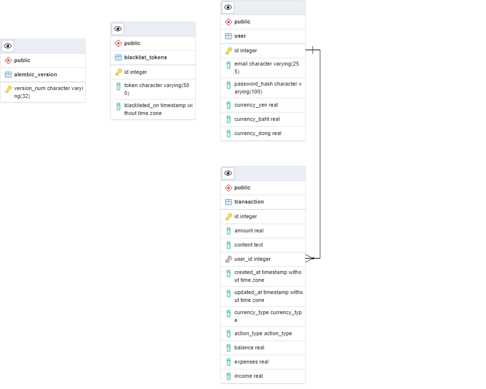

# Python-Flask-RESTful-APIs
The following features are included in the application:

* Flask: `flask version 2.0.1`
* PostgreSQL: `psql (PostgreSQL) 13.3`
* API documentation using the OpenAPI 3 specification and Swagger UI

## Database
### ERD


### Schema
- File: `database/schema.sql`
- Run schema: `psql DB_NAME < database/schema.sql`

## API Resource

### Auth user resource

```
POST   /api/v1/user/create
POST   /api/v1/user/login
```

### Account resource 
```
GET    /api/v1/account/
GET    /api/v1/account/by_current_user
POST   /api/v1/account/
PUT    /api/v1/account/
```

### Transaction resource 
```
GET    /api/v1/transaction/
POST   /api/v1/transaction/
GET    /api/v1/transaction/:id
PUT    /api/v1/transaction/
DELETE /api/v1/transaction/:id
GET    /api/v1/transaction/search
```

## Setup

To set up the application, you need Python 3. After cloning the repository change to the project directory and install the dependencies via:
```
pip install -r requirements.txt
```